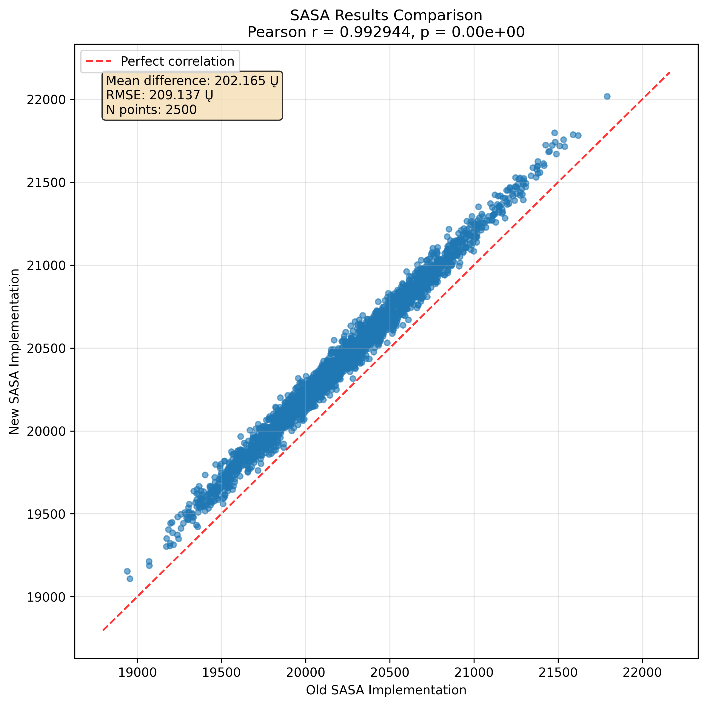

# MDSASA-Bolt ⚡️


MDSASA-Bolt is a **high-performance Python library** for computing solvent accessible surface area (SASA) of molecular dynamics trajectories. It's a drop-in replacement for mdakit-sasa that leverages RustSASA under the hood to deliver dramatically improved performance while maintaining full compatibility with MDAnalysis workflows.

## Features ✨

- ⚡️ **Ludicrous Speed**: ~4.8x faster than mdakit-sasa.
- 🔄 **Drop-in Replacement**: Compatible with existing mdakit-sasa workflows.
- 🧬 **MDAnalysis Integration**: Seamlessly works with MDAnalysis Universe and AtomGroup objects.
- 🦀 **Powered by [RustSASA](https://github.com/maxall41/RustSASA)**: Leverages Rust's performance and safety.
- 🧪 **Validated**: Tested against reference implementations
- 📊 **Trajectory Analysis**: Built for analyzing entire MD trajectories efficiently
- 🐍 **Pure Python API**: Familiar interface for Python developers

## Quick Start

### Installation

```bash
pip install mdsasa-bolt
```

### Basic Usage

```python
import MDAnalysis as mda
from mdsasa_bolt import SASAAnalysis

# Load your trajectory
u = mda.Universe("topology.pdb", "trajectory.dcd")

# Create SASA analysis
sasa_analysis = SASAAnalysis(u, select="protein")

# Run the analysis
sasa_analysis.run()

# Access results
print(f"Mean total SASA: {sasa_analysis.results.mean_total_area:.2f} Ų")
print(f"SASA per frame: {sasa_analysis.results.total_area}")
print(f"SASA per residue: {sasa_analysis.results.residue_area}")
```

### Advanced Usage

```python
import MDAnalysis as mda
from mdsasa_bolt import SASAAnalysis

# Load trajectory
u = mda.Universe("system.gro", "trajectory.xtc")

# Analyze specific selection with custom frame range
sasa_analysis = SASAAnalysis(
    u,
    select="resname LYS or resname ARG",  # Only basic residues
    start=100,                           # Start from frame 100
    stop=1000,                          # End at frame 1000
    step=10                             # Analyze every 10th frame
)

# Run analysis
sasa_analysis.run()

# Results are available as numpy arrays
total_sasa_per_frame = sasa_analysis.results.total_area
residue_sasa_matrix = sasa_analysis.results.residue_area  # Shape: (n_frames, n_residues)
mean_total_sasa = sasa_analysis.results.mean_total_area
```

## Performance Benchmarks 🚀

Benchmarks were performed using Hyperfine with DCD and PSF test trajectory files from MDAnalysisTests:

| Method | Time | Speedup |
|--------|------|---------|
| **mdsasa-bolt** | **1.156 s ± 0.014 s** | **4.8x faster** |
| mdakit-sasa | 5.501 s ± 0.060 s | baseline |

*Test system: MDAnalysisTests trajectory data*

## Validation 📊

MDSASA-Bolt has been thoroughly validated against reference implementations to ensure accuracy:



The validation shows excellent agreement between MDSASA-Bolt and reference methods, confirming that the performance improvements don't compromise accuracy.

## API Reference

### SASAAnalysis

The main analysis class that integrates with MDAnalysis.

#### Parameters

- **universe_or_atomgroup** (*Universe* or *AtomGroup*): MDAnalysis Universe or AtomGroup to analyze
- **select** (*str*, optional): Selection string for atoms (default: "all")
- **start** (*int*, optional): First frame to analyze
- **stop** (*int*, optional): Last frame to analyze
- **step** (*int*, optional): Step size between frames

#### Results

After calling `run()`, results are available in the `results` attribute:

- **total_area** (*numpy.ndarray*): Total SASA for each frame
- **residue_area** (*numpy.ndarray*): SASA per residue for each frame (shape: n_frames × n_residues)
- **mean_total_area** (*float*): Mean total SASA across all frames

## Development

### Setting up development environment

```bash
git clone https://github.com/maxall41/mdsasa-bolt.git
cd mdsasa-bolt
uv pip install -e .[dev]
```

### Running tests

```bash
pytest tests/
```

### Code formatting

This project uses Ruff for linting and formatting:

```bash
ruff check .
ruff format .
```

## Contributing

Contributions are welcome! Please feel free to submit pull requests and open issues. As this is an actively developed library, we encourage sharing your thoughts, ideas, suggestions, and feedback.

## ⚠️ A Note on Compatibility with mdakit_sasa

Inferring the element of an atom can be quite complicated. mdsasa-bolt does it's best to match the freesasa element inference algorithm, but it may not always be accurate. We recommend test the output values of mdsasa-bolt against mdakit-sasa for your usecase before using it in production. We also recommend that you use input files with explicit element information whenever possible.

## License

This project is licensed under the GNU General Public License v2.0 - see the [LICENSE](LICENSE) file for details.

## Acknowledgments

- Built on top of [RustSASA](https://github.com/maxall41/RustSASA) library
- Integrates seamlessly with [MDAnalysis](https://www.mdanalysis.org/)
- Inspired by the [mdakit-sasa](https://github.com/MDAnalysis/mdakit-sasa) project
